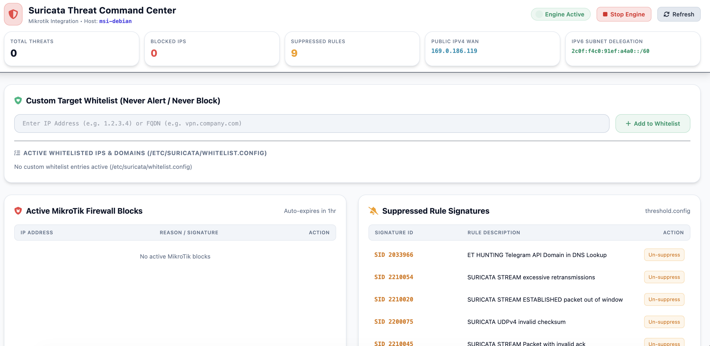

# Suricata MikroTik & Telegram Sentinel 🛡️⚡

[](https://opensource.org/licenses/MIT)
[](https://www.python.org/downloads/)
[](https://mikrotik.com/download)
[](https://suricata.io/)

A high-performance **Suricata IDS/IPS Automated Defense System** that bridges Suricata intrusion detection with MikroTik RouterOS firewalls and interactive Telegram Bot alerts.

It parses real-time Suricata `eve.json` alert streams, automatically injects threat IPs into MikroTik firewall address-lists (IPS mode), provides instant Telegram inline actions (Block/Unblock/Suppress), and features a rich, responsive Web UI Dashboard for real-time monitoring and rule tuning.


## 🖼️ System Preview



---

## ✨ System Architecture & Features

### 🛡️ 1. Active Threat Prevention (IPS Engine)
- **Automatic IP Blocking**: Instantly adds attacking source IPs to MikroTik RouterOS IP Firewall Address-List (`BLOCK_TIMEOUT = 1 hour`).
- **Cool-Down Protection**: Implements per-signature and per-IP cooldown timers (5 minutes) to prevent event flooding.
- **Dynamic Whitelisting & Subnet Discovery**: Automatically queries MikroTik interface WAN IPs, IPv6 prefixes, and local subnet ranges every 30s to suppress internal LAN-to-LAN alert noise and avoid blocking gateways.
- **Permanent Blacklisting**: Enforces permanent block rules (`/etc/suricata/blacklist.config`) that persist on RouterOS until manually removed.

### 📱 2. Interactive Telegram Bot Integration
- **Real-Time Threat Notifications**: Sends formatted threat alerts to your Telegram chat containing signature name, target IP, category, and severity.
- **Inline Action Buttons**:
  - 🛑 **Block IP**: Manually block an IP on MikroTik.
  - 🔓 **Unblock IP**: Remove an IP from MikroTik address-list (and auto-whitelist).
  - 🔕 **Suppress Signature**: Silence noisy rule alerts directly from Telegram.
  - 🛡️ **Whitelist Target/IP**: Exclude safe IPs from future automated blocks.
- **Interactive Slash Commands**:
  - `/status` - Live daemon, packet sniffer & RouterOS API status.
  - `/blocks` - Interactive active block list with inline `[ 🔓 Unblock ]` buttons.
  - `/whitelist` - View active custom whitelist with inline `[ 🗑️ Remove ]` buttons.
  - `/blacklist` - View active permanent blacklist with inline `[ 🗑️ Remove ]` buttons.
  - `/dashboard` - Quick access URL to local Web Command Center.
- **Webhook Callback Processing**: Processes Telegram button clicks in real time via secure HTTP webhook.

### 💻 3. Modern Web UI Security Command Center (`Port 8888`)
- **Live Threat Stream**: View incoming high-severity and low-severity Suricata alert events in real time with 15s deduplication badges.
- **Action Button Priority Layout**: Fixed-priority action buttons (`Unblock`, `Whitelist`, `Blacklist`, `Suppress`) that stay crisp and accessible regardless of window size.
- **Interactive Management**: Add/remove Whitelist and Permanent Blacklist entries directly from cards.
- **Rule Suppression Tuning**: Add or edit rule suppression thresholds (`threshold.config`) directly from the web interface.
- **MikroTik Active Blocks List**: View currently blocked IPs on the router with manual unblock and whitelist triggers.

### 🔄 4. TZSP Traffic Decapsulation (`tzsp_decap.py`)
- Receives MikroTik Packet Streaming (TZSP UDP 37008) traffic.
- Decapsulates raw Ethernet frames and injects them into a virtual bridge (`br-ids`) for Suricata interface sniffing without requiring physical TAP hardware.

---

## 🛠️ Complete Installation & Setup Guide

### 📋 Prerequisites

1. **Suricata IDS/IPS** installed on Linux (`/etc/suricata/suricata.yaml` configured with `eve-log` JSON enabled).
2. **MikroTik RouterOS** device with API enabled (`/ip service enable api`).
3. **Telegram Bot Token & Chat ID** (via Telegram [@BotFather](https://t.me/BotFather)).
4. **Python 3.8+** with `pip`.

---

### Step 1: Clone Repository & Install Python Dependencies

```bash
git clone https://github.com/seanco1/suricata-mikrotik-sentinel.git
cd suricata-mikrotik-sentinel
pip install -r requirements.txt
```

---

### Step 2: Environment Configuration

Copy `.env.example` to `.env`:

```bash
cp .env.example .env
```

Edit `.env` with your network and credential settings:

```ini
TELEGRAM_BOT_TOKEN="your_bot_token_here"
TELEGRAM_CHAT_ID="your_telegram_chat_id"
SURICATA_WEBHOOK_SECRET="your_random_webhook_secret"
NUC_BRIDGE_WEBHOOK_SECRET="your_random_bridge_secret"

MIKROTIK_HOST="172.18.141.1"
MIKROTIK_USER="admin"
MIKROTIK_PASS="your_secure_router_password"
BLOCK_TIMEOUT="01:00:00"

EVE_LOG_PATH="/var/log/suricata/eve.json"
THRESHOLD_CONF_PATH="/etc/suricata/threshold.config"
WHITELIST_CONF_PATH="/etc/suricata/whitelist.config"
WEB_PORT=8888
DASHBOARD_URL="https://suricata.yourdomain.com/"
```

---

### Step 3: MikroTik RouterOS Setup

#### 1. Enable RouterOS API
Log in to your MikroTik router (WinBox or SSH) and ensure the API service is enabled:

```routeros
/ip service set api disabled=no port=8728
```

#### 2. Create Firewall Drop Rule
Add a firewall rule to drop traffic originating from the `Suricata-Blocked` address-list:

```routeros
/ip firewall filter add chain=forward src-address-list=Suricata-Blocked action=drop comment="Suricata IDS Automated Block"
```

---

### Step 4: Virtual IDS Interface Setup (TZSP Sniffing)

Create systemd service `/etc/systemd/system/virtual-ids-interface.service` to create the virtual `br-ids` bridge:

```ini
[Unit]
Description=Create Virtual IDS Bridge Interface for Suricata
Before=suricata.service

[Service]
Type=oneshot
RemainAfterExit=yes
ExecStart=/bin/sh -c 'ip link add name br-ids type bridge 2>/dev/null || true; ip link set dev br-ids up; ip link add name dummy-ids type dummy 2>/dev/null || true; ip link set dev dummy-ids master br-ids; ip link set dev dummy-ids up'
ExecStop=/bin/sh -c 'ip link delete dev dummy-ids 2>/dev/null || true; ip link delete dev br-ids 2>/dev/null || true'

[Install]
WantedBy=multi-user.target
```

Enable and start the bridge service:

```bash
systemctl daemon-reload
systemctl enable --now virtual-ids-interface.service
```

---

### Step 5: Systemd Service Installation

Create `/etc/systemd/system/suricata-mikrotik.service`:

```ini
[Unit]
Description=Suricata to MikroTik & Telegram Integration Service
After=suricata.service
Wants=suricata.service

[Service]
Type=simple
User=root
WorkingDirectory=/opt/suricata-mikrotik-sentinel
ExecStart=/usr/bin/python3 daemon.py
Restart=always
RestartSec=5

[Install]
WantedBy=multi-user.target
```

Enable and start the daemon:

```bash
systemctl daemon-reload
systemctl enable --now suricata-mikrotik.service
```

---

### Step 6: Automated Suricata Threat Rule Updates & Maintenance 🔄

To keep threat intelligence up-to-date against newly discovered CVEs and attack signatures, set up automated daily rule updates using `suricata-update` and systemd timers.

#### 1. Test Manual Rule Update
Run `suricata-update` to download the latest Emerging Threats (ET Open) ruleset:

```bash
suricata-update
suricatasc -c reload-rules
```

*(Optional)* Enable additional rule sources (e.g., OISF, Abuse.ch, PT Research):

```bash
suricata-update list-sources
suricata-update enable-source et/open
suricata-update
```

#### 2. Configure Daily Automated Rule Update Timer

Create `/etc/systemd/system/suricata-update.service`:

```ini
[Unit]
Description=Suricata Threat Rules Update
After=network.target

[Service]
Type=oneshot
ExecStart=/usr/bin/suricata-update --quiet
ExecStartPost=/bin/systemctl restart suricata.service
```

Create `/etc/systemd/system/suricata-update.timer`:

```ini
[Unit]
Description=Daily Suricata Threat Rules Update Timer

[Timer]
OnCalendar=daily
RandomizedDelaySec=1800
Persistent=true

[Install]
WantedBy=timers.target
```

Enable and start the update timer:

```bash
systemctl daemon-reload
systemctl enable --now suricata-update.timer
```

#### 3. Custom Rule & Threshold Persistence Across Updates
- User signature suppressions created via Telegram button or Web UI are saved to `/etc/suricata/threshold.config`.
- Dynamic IP and target whitelists are saved to `/etc/suricata/whitelist.config`.
- Both configuration files persist untouched across rule updates and engine restarts.

---

## 📡 API & Webhook Endpoints

- `GET /`: Modern Web UI Security Dashboard.
- `GET /api/threats`: Fetch recent threats and raw alert event ring-buffer.
- `GET /api/blocked`: List active blocked IPs on MikroTik.
- `POST /api/unblock`: Unblock IP from MikroTik address-list.
- `POST /api/whitelist`: Add/Remove IP or Target signature from whitelist.
- `POST /api/suppress`: Add signature suppression rule to `threshold.config`.
- `POST /telegram/webhook`: Webhook handler for Telegram inline button click actions.

---

## 📄 License

[MIT](LICENSE) - Free to use and modify!

